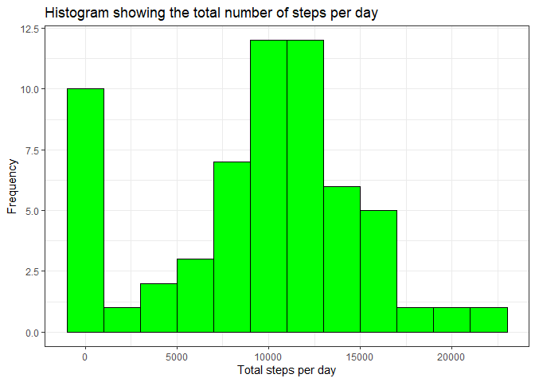
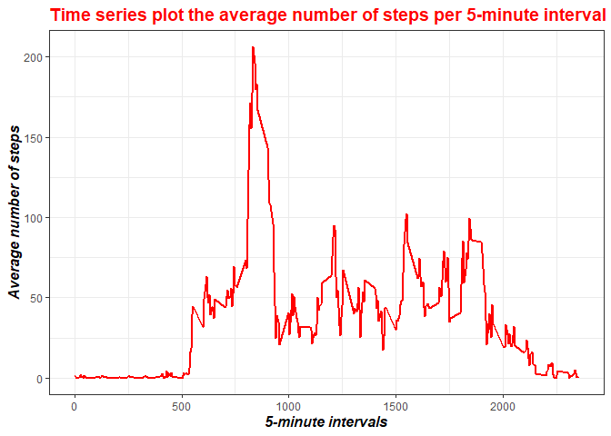
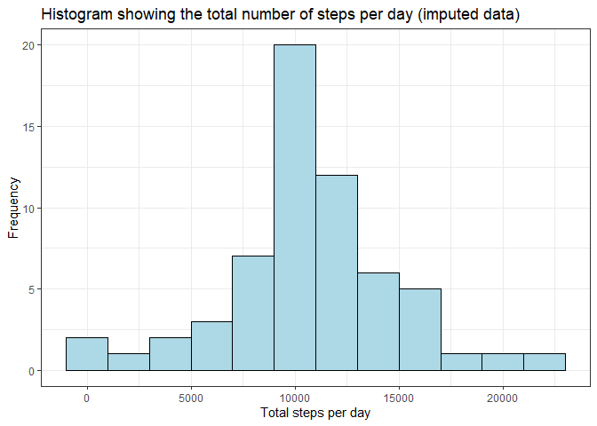
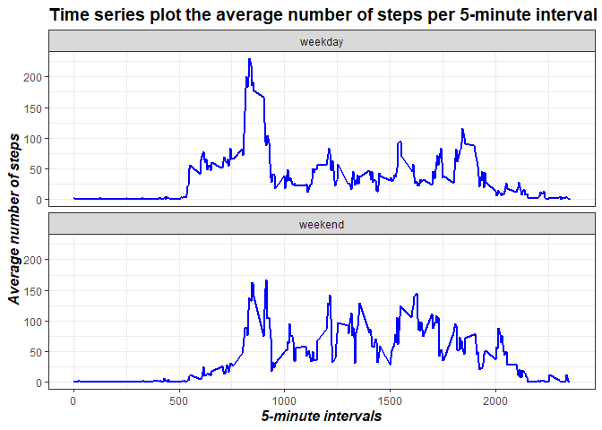

## Loading and preprocessing the data

#### Unzip the data if necessary

```r
activity <- "activity"
if (!file.exists(activity)) {
    unzip("activity.zip")
}
```

#### Load and inspect the data

```r
activity <-read.csv("activity.csv", na.strings = "NA")

str(activity)
```

```
## 'data.frame':	17568 obs. of  3 variables:
##  $ steps   : int  NA NA NA NA NA NA NA NA NA NA ...
##  $ date    : chr  "2012-10-01" "2012-10-01" "2012-10-01" "2012-10-01" ...
##  $ interval: int  0 5 10 15 20 25 30 35 40 45 ...
```
#### Since the date is a class character, better to change as date

```r
activity$date <- as.Date(activity$date, "%Y-%m-%d")
```

#### Data should now be ready to be analyzed.

=========

## What is mean total number of steps taken per day?

#### 1. Calculate the total number of steps taken per day


```r
library(dplyr)

act1 <- activity %>% 
    group_by(date) %>% 
    summarise(tot_steps = sum(steps, na.rm = T))
```

#### 2. Make a histogram of the total number of steps taken each day


```r
library(ggplot2)
# Basic histogram
ggplot(act1, aes(x=tot_steps)) + geom_histogram(binwidth = 2000,color="black", fill="green")+
    theme_bw()+
    labs(title = "Histogram showing the total number of steps per day")+
    xlab("Total steps per day")+
    ylab("Frequency")
```

<!-- -->

#### 3. Calculate and report the mean and median of the total number of steps taken per day

```r
mean <- mean(act1$tot_steps)

median <- median(act1$tot_steps)
```

#### The mean of the total number of steps per day is 9354.2295082 while the median is 10395


## What is the average daily activity pattern?

#### 1. Make a time series plot (i.e. type = "l") of the 5-minute interval (x-axis) and the average number of steps taken, averaged across all days (y-axis)


```r
act2 <- activity %>% 
    group_by(interval) %>% 
    summarise(ave_steps = mean(steps, na.rm = T))
```


```r
ggplot(act2, aes(x=interval, y=ave_steps)) + 
  geom_line(color="red", lwd=1)+
    theme_bw()+
    labs(title = "Time series plot the average number of steps per 5-minute interval")+
    xlab("5-minute intervals")+
    ylab("Average number of steps")+
 theme( plot.title = element_text(color="red", size=14, face="bold"),
  axis.title.x = element_text(size=12, face="bold.italic"),
  axis.title.y = element_text(size=12, face="bold.italic"))
```

<!-- -->


#### 2. Which 5-minute interval, on average across all the days in the dataset, contains the maximum number of steps?

```r
max <- act2$interval[which.max(act2$ave_steps)]
```

#### The 5-minute interval with the maximum number of steps is 835.


## Imputing missing values

#### 1. Calculate and report the total number of missing values in the dataset (i.e. the total number of rows with \color{red}{\verb|NA|}NAs)


```r
Mis <- is.na(activity$steps)

Mis <- sum(Mis)
```

#### The total numebr of missing values in the dataset is 2304.

#### 2. Devise a strategy for filling in all of the missing values in the dataset. The strategy does not need to be sophisticated. For example, you could use the mean/median for that day, or the mean for that 5-minute interval, etc.

#### Since the mean for some days is NA, the mean for 5-minutes interval has been used to replace missing values.

```r
### Replacing missing values

activity_IMP <- activity %>% 
    group_by(date) %>% 
  mutate(ave_day = mean(steps, na.rm = T)) %>% 
  group_by(interval) %>% 
  mutate(ave_inter=mean(steps, na.rm = T))
    


activity_IMP$steps <- ifelse(is.na(activity_IMP$steps), activity_IMP$ave_inter, activity_IMP$steps)
```


#### 3. Create a new dataset that is equal to the original dataset but with the missing data filled in.
#### The new dataset containg imputed data is called activity_IMP


```r
activity_IMP <- activity_IMP[,c(1:3)]
table(is.na(activity_IMP$steps))
```

```
## 
## FALSE 
## 17568
```

```r
head(activity_IMP)
```

```
## # A tibble: 6 x 3
## # Groups:   interval [6]
##    steps date       interval
##    <dbl> <date>        <int>
## 1 1.72   2012-10-01        0
## 2 0.340  2012-10-01        5
## 3 0.132  2012-10-01       10
## 4 0.151  2012-10-01       15
## 5 0.0755 2012-10-01       20
## 6 2.09   2012-10-01       25
```

#### 4. Make a histogram of the total number of steps taken each day and Calculate and report the mean and median total number of steps taken per day. Do these values differ from the estimates from the first part of the assignment? What is the impact of imputing missing data on the estimates of the total daily number of steps?


```r
act3 <- activity_IMP %>% 
  group_by(date) %>% 
  summarise(tot_day = sum(steps))


ggplot(act3, aes(x=tot_day)) + 
  geom_histogram(binwidth = 2000,color="black", fill="lightblue")+
    theme_bw()+
    labs(title = "Histogram showing the total number of steps per day (imputed data)")+
    xlab("Total steps per day")+
    ylab("Frequency")
```

<!-- -->

```r
IMP_mean <- mean(act3$tot_day)

IMP_median <- median(act3$tot_day)

mean_diff <-IMP_mean -  mean 

median_diff <-  IMP_median-median
```
#### The mean of the total number of steps per day after Imputing the data is 1.0766189\times 10^{4} while the median is 1.0766189\times 10^{4}.
#### The difference between imputed and non-imputed data is 1411.959171 for the mean and  371.1886792 for the median.
#### The estimates on the total number of daily steps seems to increase after imputation.


## Are there differences in activity patterns between weekdays and weekends?
###For this part the \color{red}{\verb|weekdays()|}weekdays() function may be of some help here. Use the dataset with the filled-in missing values for this part.

#### 1. Create a new factor variable in the dataset with two levels – “weekday” and “weekend” indicating whether a given date is a weekday or weekend day.


```r
act4 <- activity_IMP

weekend <- c("sabato", "domenica")

act4$wd <- weekdays(act4$date)

act4$weekday <- ifelse(act4$wd %in% weekend, "weekend", "weekday")

act4$weekday <- as.factor(act4$weekday)
```


#### 2. Make a panel plot containing a time series plot (i.e. \color{red}{\verb|type = "l"|}type = "l") of the 5-minute interval (x-axis) and the average number of steps taken, averaged across all weekday days or weekend days (y-axis). See the README file in the GitHub repository to see an example of what this plot should look like using simulated data.


```r
act5 <- act4 %>% 
    group_by(weekday,interval) %>% 
    summarise(ave_steps = mean(steps, na.rm = T))
```

```
## `summarise()` has grouped output by 'weekday'. You can override using the `.groups` argument.
```


```r
ggplot(act5, aes(x=interval, y=ave_steps)) + 
  geom_line(color="blue", lwd=1)+
    theme_bw()+
    labs(title = "Time series plot the average number of steps per 5-minute interval")+
    xlab("5-minute intervals")+
    ylab("Average number of steps")+
 theme( plot.title = element_text(color="black", size=14, face="bold"),
  axis.title.x = element_text(size=12, face="bold.italic"),
  axis.title.y = element_text(size=12, face="bold.italic"))+
    facet_wrap(~ weekday, nrow = 2)
```

<!-- -->


